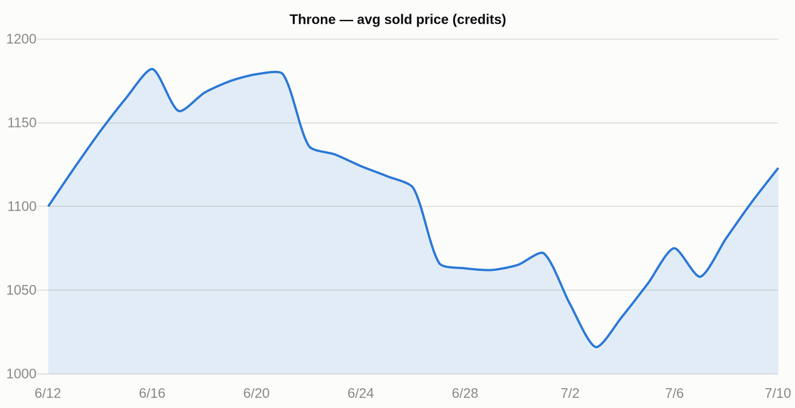
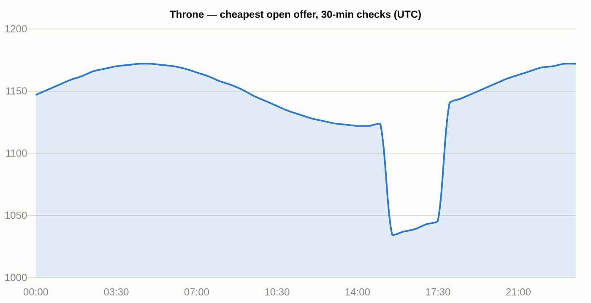

# Habbo Marketplace Tracker Bot

A Telegram bot that tracks [Habbo Hotel](https://www.habbo.com) marketplace prices:
instant lookups, 30-day trend charts, inline search in any chat, and automated
price-drop alerts — running 24/7 on Cloudflare's free tier with **zero runtime
dependencies**.

**Try it live: [@habbomptracker_bot](https://t.me/habbomptracker_bot)** — `/price`,
`/history`, and inline search are open to everyone (rate-limited); watches are
restricted in the public demo.

## Features

| Command | What it does |
|---|---|
| `/price <item>` | Ranked fuzzy search (exact → prefix → substring), up to 10 items priced in **one** batched API call |
| `/history <item>` | 30-day price chart (PNG) for any tradable item, plus an intraday chart for watched items |
| `/watch <item> <credits>` | Alert when the price drops to/below your threshold — checked every 30 minutes |
| `/unwatch`, `/watchlist` | Manage watches |
| `@botname <query>` inline | Price cards with furni icon thumbnails, from any chat |

Example `/history` output (synthetic data):




## Architecture

```
                       ┌──────────────────────────────┐
 Telegram  ──webhook──▶│  Cloudflare Worker (prod)    │──▶ Habbo furnidata (Cache API, 24h)
                       │  · command routing           │──▶ Habbo stats batch API
                       │  · cron: check watches /30min│──▶ QuickChart (history PNGs)
                       │  · D1: watches + snapshots   │
                       └──────────────┬───────────────┘
                                      │ shared logic
                       ┌──────────────▼───────────────┐
 Telegram ──polling───▶│  bot.js (local dev runner)   │
                       └──────────────────────────────┘
```

- **`lib/habbo.js`** — runtime-agnostic core: search ranking, batched stats
  fetching, message building, Markdown escaping, fetch timeouts. Both runners
  import it, so features land everywhere at once.
- **`habbo-bot-worker/`** — production runner. Webhook-based Cloudflare Worker
  with a D1 (SQLite) database for watches and 30-minute price snapshots, a cron
  trigger for alert checks, and the Cache API for furnidata caching.
- **`bot.js`** — dependency-free local runner using `getUpdates` long-polling,
  for development without touching production.

### Design decisions

- **One batched stats call, always.** The Habbo batch endpoint prices any number
  of items per request — searching "throne" prices 10 items with 1 HTTP call.
- **Alerts fire once per threshold crossing.** An `alerted` flag suppresses
  repeats while the price stays low and re-arms when it recovers — no alert spam.
- **Two-layer furnidata cache** on the worker: warm-isolate module global +
  Cloudflare Cache API, refreshed daily. The multi-MB catalog is fetched at most
  once a day per edge location.
- **Charts without a canvas.** Workers can't render images, so `/history` builds
  a Chart.js config and lets QuickChart render the PNG; Telegram fetches it by
  URL. Text sparkline fallback if the chart service is down.
- **Public demo, protected writes.** Read commands are open with a per-user rate
  limit; stateful commands (watches → D1 rows + cron work) are whitelisted.

## Running it yourself

**Prerequisites:** a bot token from [@BotFather](https://t.me/BotFather), Node 18+,
and (for production) a free Cloudflare account.

Local (polling):

```bash
export TELEGRAM_TOKEN="your-token"   # setx on Windows
node bot.js
```

Production (Cloudflare Workers):

```bash
cd habbo-bot-worker
npx wrangler d1 create habbo-tracker          # then put the id in wrangler.jsonc
npx wrangler d1 execute habbo-tracker --remote --file=schema.sql
npx wrangler secret put TELEGRAM_TOKEN
npx wrangler deploy
curl "https://api.telegram.org/bot<TOKEN>/setWebhook?url=https://<your-worker>.workers.dev"
```

Telegram delivers updates to either a webhook **or** polling, never both —
`deleteWebhook` to develop locally, `setWebhook` to hand back to the worker.

Tests: `npx vitest run` in `habbo-bot-worker/`.
